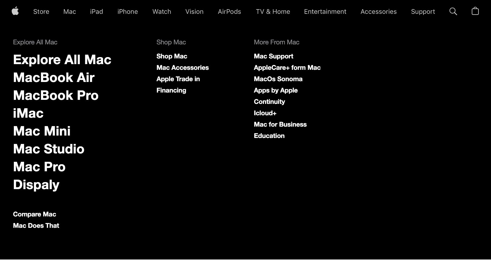

# AppleNavBar / Submenu
<h1 align="center"> Projeto - Apple Navbar 2023  </h1>

  

 Projeto - Apple Navbar 2023 é um projeto que foi criado com intuito de aplicar conhecimentos em HTML, CSS, Javascript criando um clone do menu de navegação do site da Apple   

  

 

## 🚀 Tecnologias

Esse projeto foi desenvolvido com as seguintes tecnologias:

- HTML e CSS
- JavaScript
- Git e Github

## 🚀Aprendizado

Nesse projeto pude últilizar todo o meus conhecimentos de HTML,CSS e aprimorar ainda mais meus conhecimentos criando a parte do submenu do projeto  que foi um pouco mais desafiador.

## 💻  Link do Projeto

- [Acesse o projeto](https://kleitonads.github.io/AppleNavBar/)
